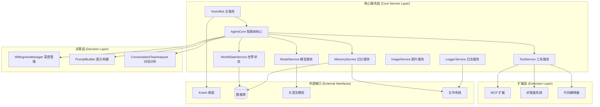

# 智能体架构

YesImBot 采用现代化的服务导向架构（SOA），通过模块化设计实现高度可扩展和可维护的智能体系统。

## 整体架构概览



## 核心服务详解

### YesImBot 主服务
- **职责：** 系统的入口点和总协调者。
- **功能：**
    - 管理所有子服务的生命周期。
    - 处理来自 Koishi 的消息和事件。
    - 协调各服务间的交互。
    - 提供统一的配置管理接口。

### AgentCore 智能体核心
- **职责：** 智能体的大脑，负责决策和执行。
- **核心流程：**
    1.  **消息接收：** 从 Koishi 接收用户消息。
    2.  **意愿判断：** 通过 `WillingnessManager` 评估是否响应。
    3.  **上下文构建：** 获取世界状态和相关记忆。
    4.  **模型调用：** 通过 `ModelService` 与 LLM 交互。
    5.  **工具执行：** 根据需要调用相关工具。
    6.  **响应生成：** 产生最终回复并记录。

```python
# 核心处理流程伪代码
async def process_message(message):
    # 1. 意愿判断
    if not await willingness_manager.should_reply(message):
        return
    
    # 2. 构建世界状态
    world_state = await world_state_service.get_state(message.channel)
    
    # 3. 检索相关记忆
    memories = await memory_service.retrieve_relevant(message.content)
    
    # 4. 构建提示词
    prompt = prompt_builder.build(world_state, memories, message)
    
    # 5. 调用模型
    response = await model_service.chat(prompt)
    
    # 6. 执行工具（如需要）
    if response.tool_calls:
        tool_results = await tool_service.execute(response.tool_calls)
        response = await model_service.chat_with_tools(prompt, tool_results)
    
    # 7. 记录和响应
    await world_state_service.record_interaction(message, response)
    return response
```

### ModelService 模型服务
- **职责：** 管理与各种大语言模型的交互。
- **特性：**
    - 多提供商支持（OpenAI、Anthropic、Ollama 等）。
    - 模型组管理和故障转移。
    - 任务专用模型分配。
    - 流式响应处理。

### WorldStateService 世界状态
- **职责：** 管理对话上下文和短期历史记录。
- **核心功能：**
    - 对话历史管理。
    - 智能上下文窗口控制。
    - 自动历史总结。
    - 频道状态追踪。

### MemoryService 记忆服务
- **职责：** 实现多层记忆架构。
- **架构：**
    - **核心记忆 (Core Memory):** Markdown/文本文件，存储基础设定、性格描述。
    - **档案记忆 (Archive Memory):** 向量数据库，存储历史对话、学习经验，用于语义检索。
    - **对话记忆 (Conversation Memory):** 关系数据库，存储近期对话历史。

## 决策层组件

### WillingnessManager 意愿管理
- **职责：** 实现四层意愿决策模型，决定何时响应。
- **决策层次：**
    1.  **基础分数：** 根据消息类型给予初始分数。
    2.  **属性加成：** @提及、回复、私聊等属性加分。
    3.  **兴趣模型：** 基于关键词和内容的兴趣乘数。
    4.  **精力模拟：** 模拟疲劳和恢复机制。

### PromptBuilder 提示构建
- **职责：** 动态构建高质量的模型提示词。
- **构建要素：**
    - 系统提示词模板
    - 核心记忆注入
    - 世界状态描述
    - 工具可用性声明
    - 对话历史整理

## 可扩展性设计

### 插件化架构
YesImBot 采用插件化架构，核心功能与扩展功能完全分离：
```
yesimbot (核心包)
├── koishi-plugin-yesimbot-extension-mcp
├── koishi-plugin-yesimbot-extension-favor
└── koishi-plugin-yesimbot-extension-code-interpreter
```

### 工具开发接口
提供标准化的接口，方便开发者创建新的工具。
```typescript
interface Tool {
  name: string;
  description: string;
  parameters: ToolParameters;
  execute(args: any): Promise<ToolResult>;
}
// 注册工具
toolService.register(new CustomTool());
```