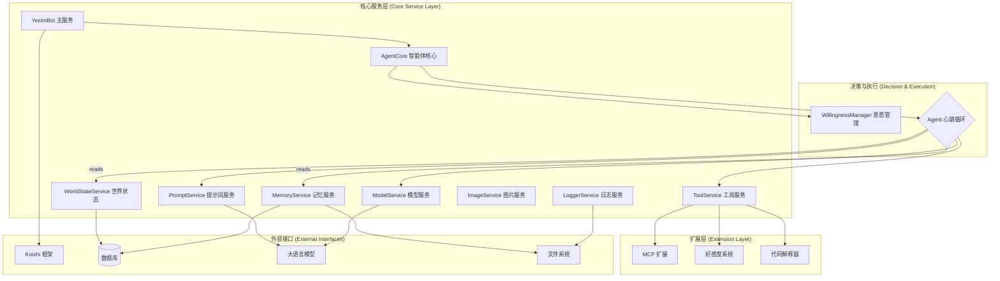

# 智能体架构

YesImBot 采用现代化的服务导向架构（SOA），通过模块化设计实现高度可扩展和可维护的智能体系统。

## 整体架构概览



## AgentCore: 核心处理流程

`AgentCore` 是智能体的中枢神经系统，它编排所有服务来响应用户。其处理流程精密且健壮，确保了响应的智能性和稳定性。

1.  **意愿计算 (Willingness Calculation):**
    -   当收到新消息时，`AgentCore` 首先将消息交给 `WillingnessManager`。
    -   `WillingnessManager` 根据[四层决策模型](./willingness-system.md)计算出当前的“意愿分数”和“回复概率”。

2.  **响应决策 (Reply Decision):**
    -   `AgentCore` 根据回复概率，随机决定本次是否要响应。如果决定不响应，流程终止。

3.  **防抖机制 (Debounce):**
    -   为防止因短时间内连续收到消息而导致机器人刷屏，`AgentCore` 采用了防抖机制。它会等待一小段时间（由 `agentBehavior.arousal.debounceMs` 配置），如果在此期间没有新的触发，才会继续执行。

4.  **任务锁定 (Task Locking):**
    -   在开始真正的“思考”之前，`AgentCore` 会为当前频道上锁，确保同一时间只有一个回复任务在运行，避免了逻辑混乱和重复响应。

5.  **Agent 心跳循环 (Agent Heartbeat Cycle):**
    -   这是 Agent 的核心思考过程，它模仿了人类“观察-思考-行动”的循环模式（ReAct）。
    -   在一个心跳内，Agent 会：

        a. **构建上下文**: 从 `MemoryService` 和 `WorldStateService` 收集所有相关信息。

        b. **构建提示词**: 使用 `PromptService` 将上下文渲染成发送给 LLM 的最终提示词。

        c. **调用模型**: 通过 `ModelService` 与 LLM 交互。

        d. **解析与行动**: 解析 LLM 返回的“想法”和“行动”（如工具调用），并使用 `ToolService` 执行。

    -   LLM 可以请求**再次心跳** (`request_heartbeat`)，以便在一次回复中使用多次工具或进行更复杂的推理。此循环有最大次数限制（由 `agentBehavior.heartbeat` 配置）。

6.  **记录与解锁 (Record & Unlock):**
    -   循环结束后，所有思考和行动的结果都会被 `WorldStateService` 记录下来，成为未来对话的记忆一部分。
    -   最后，释放频道锁，等待下一次触发。

## 核心服务详解

### 1. 模型服务 (ModelService)
-   **职责:** 管理与各种大语言模型的交互。
-   **特性:**
    -   **多提供商支持:** 支持 OpenAI、Anthropic、Ollama 等多种模型提供商。
    -   **模型组管理:** 实现模型故障转移机制。
    -   **专用模型分配:** 可为不同任务分配特定的模型。
    -   **流式响应:** 支持流式响应处理。

### 2. 记忆系统 (Memory System)
该系统由 `MemoryService` 和 `WorldStateService` 共同构成。

-   **`MemoryService` (记忆服务)**
    -   **职责:** 实现多层记忆架构，提供核心记忆。
    -   **架构:**
        -   **核心记忆 (Core Memory):** 通过 Markdown/文本文件存储，包含 Agent 的基础设定、性格描述等长期不变的人设和知识。
        -   **档案记忆 (Archive Memory):** 基于向量数据库，用于存储历史对话和学习经验，支持语义检索。
        -   **对话记忆 (Conversation Memory):** 基于关系数据库，存储近期的对话历史。

-   **`WorldStateService` (世界状态服务)**
    -   **职责:** 管理动态的对话历史和上下文（短期记忆）。
    -   **核心功能:**
        -   对话历史管理。
        -   智能上下文窗口控制。
        -   自动历史总结。
        -   频道状态追踪。

### 3. 工具服务 (ToolService)
-   **职责:** 管理和执行所有可用的工具。
-   **核心功能:**
    -   向 LLM 提供工具定义。
    -   解析模型的工具调用请求。
    -   执行工具并返回结果。

## 决策层组件

### 1. 意愿管理器 (WillingnessManager)
-   **职责:** 作为 Agent “是否发言”的唯一决策者，模拟人类的社交直觉。
-   **决策层次（四层意愿模型）:**
    1.  **基础分数:** 根据收到的消息类型（如普通消息、指令等）给予一个初始意愿分数。
    2.  **属性加成:** 当消息包含特定属性时进行加分，例如被 @提及、被回复或在私聊中。
    3.  **兴趣模型:** 根据预设的关键词和消息内容，计算出一个兴趣乘数，调整意愿分数。
    4.  **精力模拟:** 引入模拟的疲劳和恢复机制，影响最终的发言意愿。

### 2. 提示词服务 (PromptService / 提示构建)
-   **职责:** 一个功能全面的提示词管理和渲染服务，负责动态构建高质量的模型提示词。
-   **核心功能:**
    -   管理所有提示词模板（包括系统、用户、局部模板）。
    -   使用 [Mustache](https://mustache.github.io/) 引擎，将动态的上下文数据填充到模板中，生成最终发送给 LLM 的内容。
-   **提示词构建要素:**
    -   系统提示词模板
    -   核心记忆注入
    -   世界状态描述
    -   工具可用性声明
    -   对话历史整理

## 可扩展性设计

### 1. 插件化架构
YesImBot 的核心功能与扩展功能完全分离，采用插件化架构。
```
yesimbot (核心包)
├── koishi-plugin-yesimbot-extension-mcp
├── koishi-plugin-yesimbot-extension-favor
└── koishi-plugin-yesimbot-extension-code-interpreter
```

### 2. 工具开发接口
提供标准化的接口，方便开发者为 Agent 创建和注册新的工具。

**接口定义:**
```typescript
interface Tool {
  name: string;
  description: string;
  parameters: ToolParameters;
  execute(args: any): Promise<ToolResult>;
}
```
**注册示例:**
```typescript
// 注册工具
toolService.register(new CustomTool());
// 或者将其作为插件注册
ctx.plugin(CustomToolPlugin, customToolConfig);
```