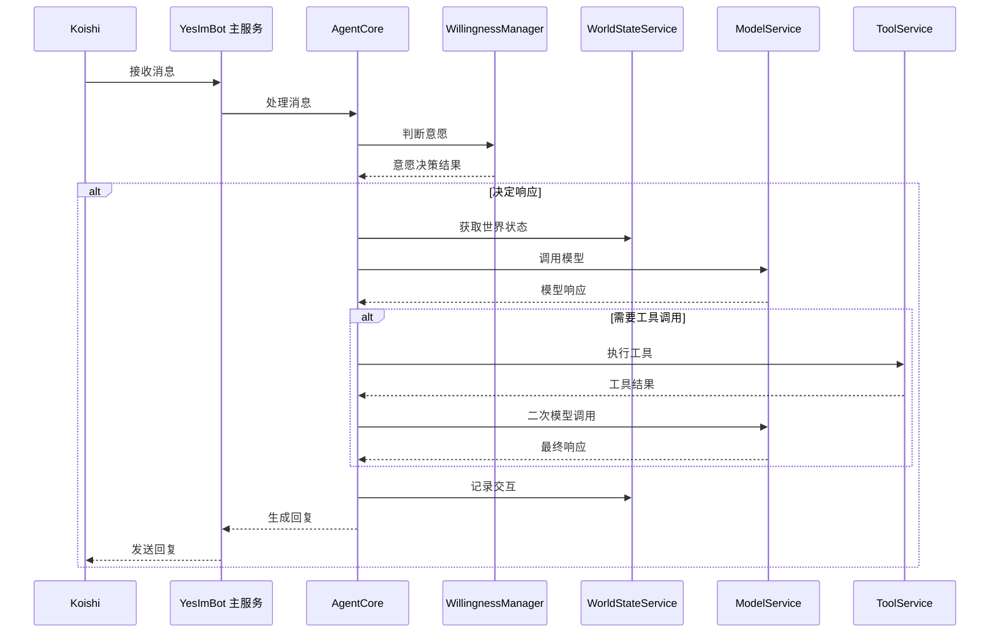

# 概述

欢迎来到 YesImBot 的世界！本页将为您详细介绍 YesImBot 的核心特性，并展示其如何处理信息，帮助您快速理解这个插件的独特之处。

## 核心特性一览

-   **🤖 动态意愿系统 (Willingness System)**
    -   基于“性格预设”和高度可调的参数，精确控制机器人的发言意愿和频率。
    -   综合评估消息类型、@提及、回复关系、关键词等多重因素，实现智能决策。
    -   模拟精力的“生命周期”机制，避免机器人无限刷屏。

-   **🧠 记忆与世界状态 (Memory & World State)**
    -   通过 Markdown 文件定义机器人的核心记忆和背景设定，稳定且易于编辑。
    -   `WorldStateService` 自动管理对话历史，通过智能摘要技术在保留关键信息的同时，有效控制上下文长度，理论上实现无限对话记忆。

-   **☁️ 模型服务 (Model Service)**
    -   支持几乎所有兼容 OpenAI 的 LLM API，以及 Anthropic、Ollama、Google Gemini 等多种特定模型提供商。
    -   通过“模型组”实现精细的任务路由（如聊天、总结、嵌入使用不同模型）和强大的故障转移能力。

-   **🛠️ 可扩展工具系统 (Tool System)**
    -   核心插件提供稳固的工具调用框架，具体功能由扩展插件（如代码解释器、好感度系统）提供。
    -   支持通过外部 MCP (Model Context Protocol) 服务器动态注册和使用新工具。

-   **👁️ 视觉能力 (Vision)**
    -   支持多模态模型，能够理解对话中出现的图片内容。
    -   可精细配置图片在上下文中的生命周期和最大数量，兼顾性能与效果。

-   **⚙️ 交互式配置与管理**
    -   `setup` 指令提供保姆级的交互式配置向导。
    -   `conf.get` / `conf.set` 指令允许管理员在运行时动态查看和修改配置。

-   **🧩 插件化架构**
    -   核心功能与扩展插件（`mcp`, `favor`, `code-interpreter`）分离，按需安装，保持核心的轻量化。

## 功能流程一览

下图直观地展示了 YesImBot 从接收消息到生成回复的完整处理流程，帮助您理解各个核心服务是如何协同工作的。

