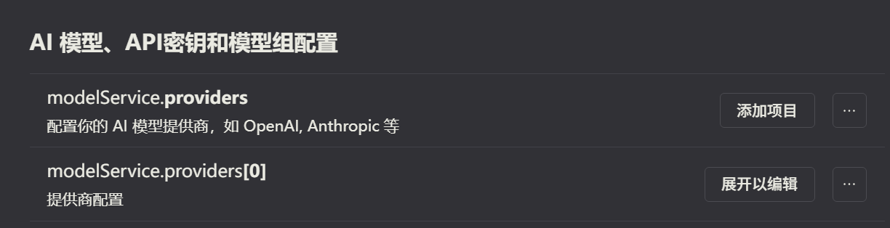
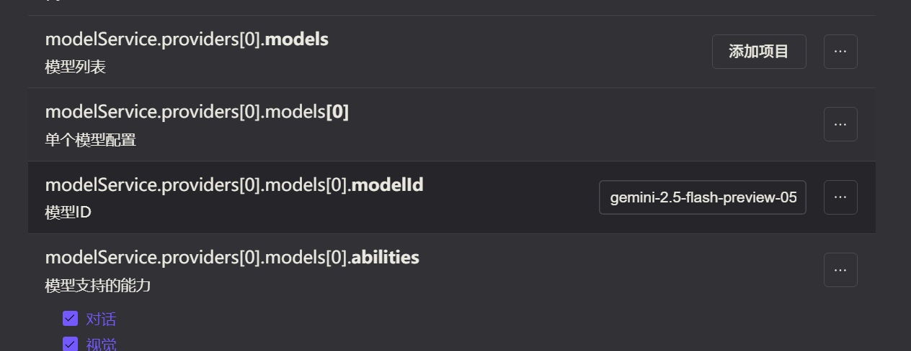
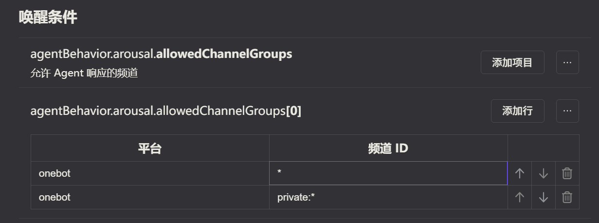
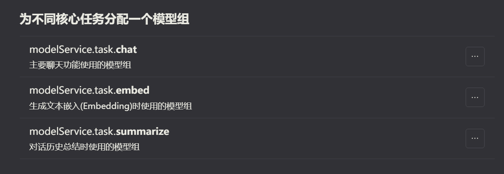
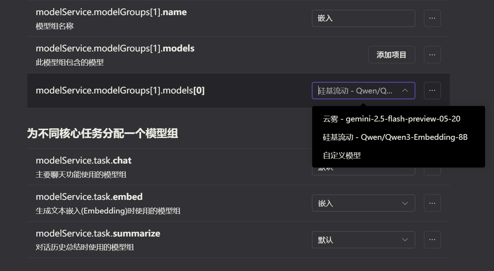

# 快速上手

安装并启用插件后，您需要进行一些关键配置，让 YesImBot 拥有对话的能力。本指南将引导您完成首次配置。

!!! danger "重要：启动必要条件"
    在开始配置前请注意，YesImBot 插件有两项**必须满足**的启动条件，否则插件将无法正常加载：

    1.  **配置可用模型：** 必须在 `modelService` 中至少配置一个能正常使用的 AI 模型。
    2.  **指定响应频道：** 必须在 `agentBehavior.arousal.allowedChannelGroups` 中至少添加一个允许 Bot 响应的频道。

1.  **配置可用模型**：至少需要配置一个能正常使用的模型。



2.  **指定响应频道**：必须添加至少一个允许 Bot 响应的频道。


### **一、模型组配置**

模型组的配置选项依赖于已有的模型，因此请**先成功启动一次插件**。

只有启动插件，这里的选项才会显示出来：


启动后：


**配置步骤：**

1.  **创建模型组**：在配置界面找到「模型组」设置，点击“添加”创建新的一行，并展开进行编辑。

2.  **填写信息**：
    *   **模型组名称**：为其命名，例如 `default`。
    *   **选择模型**：从下拉列表中选择要加入该组的模型。此列表会自动显示您已配置好的可用模型。

3.  **保存并应用**：点击「重载配置」按钮保存更改。新的模型组会立即生效，并出现在可选项中。

!!! info "💡 提示"
    无论是选择模型还是模型组，都强烈建议**从下拉列表中选择预设项**，而不是手动输入名称，以避免因拼写错误导致配置失败。

### **二、 记忆库配置**

#### **文件位置**

*   记忆文件默认存放于 `data/yesimbot/memory/core/` 目录下，你可以复制或创建一个 txt/md 格式的文件。
*   插件会自动加载此目录中所有**格式正确**的记忆文件。

#### **文件格式**

文件必须使用 **YAML Front Matter** 来定义元信息，其下方为记忆正文。

**元信息（必填部分）：**
```yaml
---
title: string # (可选)
label: string # (必填)
limit: number # (必填)
description: string # (可选) 描述信息
---

这里是记忆的正文内容，可以填入人设等自定义内容。
```

**关键点：**

*   `label`, `limit` 为**必填字段**，缺少任何一个都会导致该文件加载失败。
*   `description`, `title` 为可选字段。

## 手动配置 (高级)

如果您偏好手动编辑 `koishi.yml` 或在 Web UI 的 YAML 编辑器中配置，以下是一个能让机器人工作的最小化配置。

**请务必将 `apiKey`、`modelId` 和 `id` (群号) 替换为您自己的信息。**

```yaml
# 在 koishi.yml 的 plugins 下
yesimbot:
  modelService:
    providers:
      - name: my_openai_provider
        enabled: true
        type: OpenAI
        apiKey: sk-xxxxxxxxxxxxxxxxxxxxxxxxxxxxxx # 你的 API Key
        models:
          - modelId: gpt-4-turbo # 你要使用的模型 ID
            abilities:
              - 对话
              - 函数调用
            parameters:
              temperature: 1.36
              topP: 0.8
              stream: true
    modelGroups:
      - name: default_group
        models:
          - providerName: my_openai_provider
            modelId: gpt-4-turbo
    task:
      chat: default_group
      embed: default_group
      summarize: default_group
  agentBehavior:
    arousal:
      allowedChannelGroups:
        - - platform: onebot # 允许响应的平台
            id: '123456789' # 允许响应的群号
```

## 验证配置

配置完成后，在您 `allowedChannelGroups` 中指定的群组里，尝试 `@` 机器人并向它问好：

```
@你的机器人 你好！
```

如果它能正常回复，说明您的基础配置已经成功！

## 首次运行问题排查

-   **机器人不回复:**
    -   确认已在 `agentBehavior.arousal.allowedChannelGroups` 中正确配置了当前群组。
    -   检查 `modelService.providers` 中的 `apiKey` 是否正确、有效。
    -   检查 Koishi 控制台日志，查看是否有 API 报错（如 401, 429）。
-   **`setup` 指令无反应:**
    -   确认发送指令的用户权限等级 ≥ 3。

!!! success "恭喜！"
    您已完成 YesImBot 的基础配置。现在，您可以开始深入探索它的 [核心概念](../concepts/agent-architecture.md) 或查阅完整的 [配置参考](../reference/configuration.md) 来进一步定制您的 AI 伙伴了。
